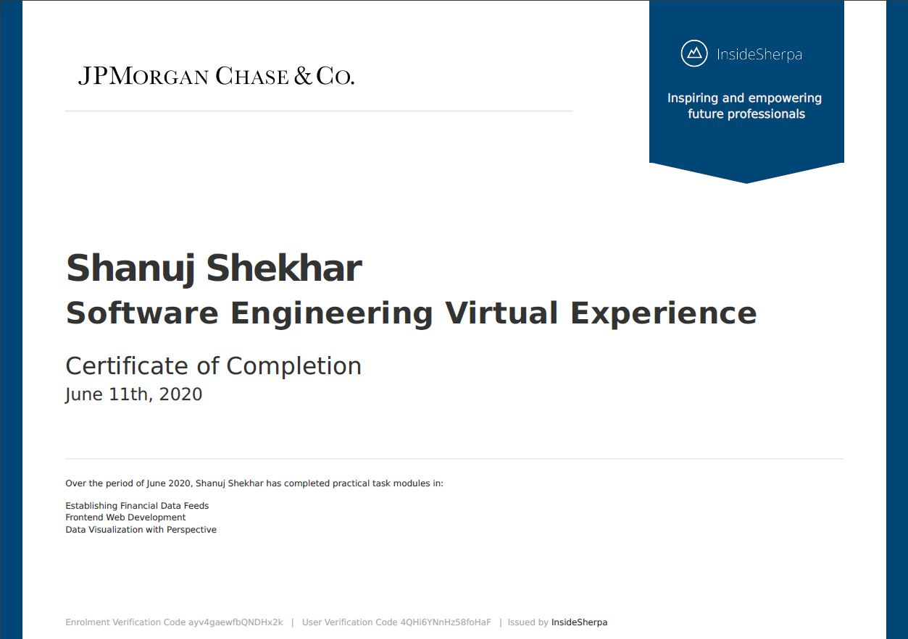

# Introduction
This repository showcases my work experience in the JP Morgan & Chase Co virtual internship.

### Task 1
    Implemented an interface with a stock price data feed and set up my system for analysis of the data

### Task 2
    Implemented the Perspective open source code for preparing visualization of trader's data

### Task 3
    Used the perspective tool to create the chart for the trader's dashboard

## Certificate of Completion

## Website Link
https://www.insidesherpa.com/virtual-internships/R5iK7HMxJGBgaSbvk
